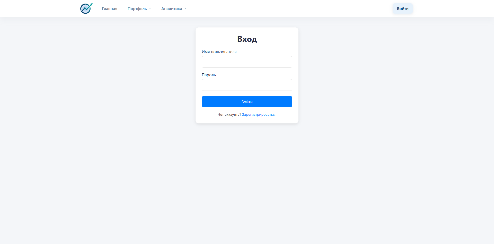
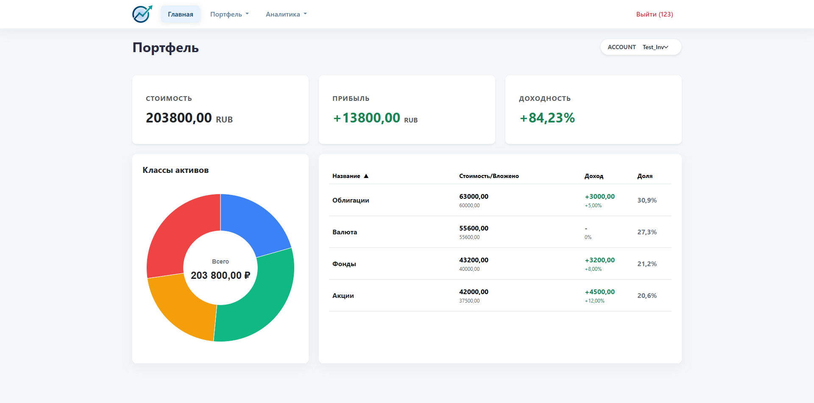
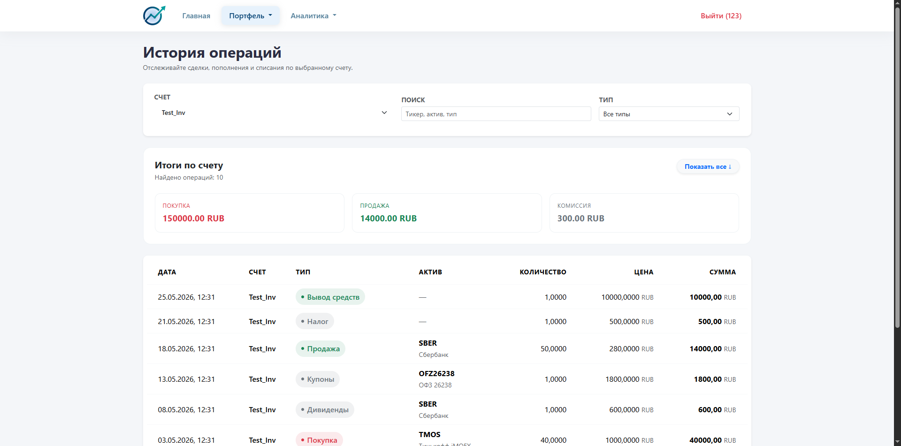

# OpenInvest.Monitor

[](https://www.python.org/)
[](https://www.djangoproject.com/)
[](https://pandas.pydata.org/)
[](https://opensource.tbank.ru/invest/invest-python)
[](TZ.md)

Платформа для консолидации инвестиционных данных и расчета реальной доходности портфеля с учетом пополнений, выводов и налогов. MVP ориентирован на интеграцию с Т-Банком (Т-Инвестиции) и масштабирование под других брокеров.

## Возможности
- Подключение брокерских счетов и безопасное хранение API‑токенов (шифрование `Fernet`).
- Синхронизация операций через API брокера с дедупликацией по `external_id`.
- Аналитика портфеля: XIRR, метрики и визуализации.
- Дашборд с графиками распределения активов.
- Разделение доступа: пользователь видит только свои данные.

## Стек технологий
- **Backend:** Django, Django ORM
- **Аналитика:** pandas, pyxirr
- **Безопасность:** cryptography Fernet
- **Интеграции:** T‑Invest API, резервно MOEX ISS API
- **Frontend:** Bootstrap, ApexCharts

## Архитектура
- **Service Layer:** бизнес‑логика и интеграции в `portfolio/services/`.
- **Тонкие views и модели:** модели — структура данных, views — обработка запросов и вызов сервисов.
- **Адаптер брокера:** интеграция с API изолирована.

## Модель данных
ER‑диаграмма:


Подробное описание и сценарии — в `TZ.md`.

## Быстрый старт (локально)
1) Создайте и активируйте виртуальное окружение.
2) Установите зависимости.
3) Настройте переменные окружения.
4) Примените миграции и запустите сервер.

Пример команд (Windows cmd):

```cmd
python -m venv .venv
.venv\Scripts\activate
pip install -r requirements.txt
```

> Примечание: для установки `t-tech-investments` нужен индекс T-Bank:
> `pip install t-tech-investments --index-url https://opensource.tbank.ru/api/v4/projects/238/packages/pypi/simple`

Создайте файл `.env` на основе `example.env` и заполните значения:
- `SECRET_KEY`
- `DEBUG`
- `FERNET_KEY`

Далее примените миграции и запустите сервер:

```cmd
python manage.py migrate
python manage.py runserver
```

Чтобы заполнить базу демонстрационными данными для дашборда:

```cmd
python manage.py seed_demo_portfolio
```

По умолчанию команда создаёт пользователя `123` и счет `Test_Inv`.

## Скриншоты






## Безопасность
- API‑токены сохраняются только в зашифрованном виде.
- В UI выводится маскированный токен.
- Все запросы к данным фильтруются по пользователю.

## Тестирование

```cmd
python manage.py test
```

## Структура проекта
```
OpenInvest.Monitor/
├─ config/                 # настройки Django
├─ portfolio/              # логика инвестиций, сервисы, шаблоны
├─ users/                  # пользователи, авторизация
├─ examples/               # примеры работы с API
├─ TZ.md                   # техническое задание
└─ manage.py
```

---

**Статус:** MVP готов, активное развитие.
