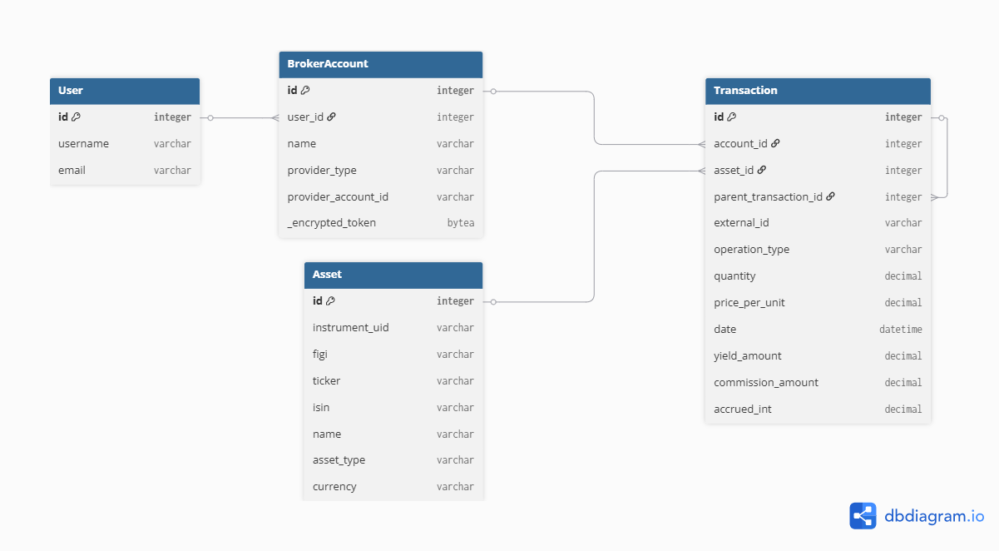

# Техническое задание на проект OpenInvest.Monitor 
*(Платформа консолидации инвестиционных данных)*

## 1. Название и концепция
Проект **«OpenInvest.Monitor»** — это аналитическая платформа для мониторинга инвестиционного портфеля.
Основная проблема, которую решает сервис: отсутствие у частных инвесторов единого бесплатного инструмента для агрегации данных от разных брокеров и точного расчета реальной доходности портфеля с учетом пополнений, выводов и налогов.
На этапе MVP реализована интеграция с Т-Банком (Т-Инвестиции), но архитектура заложена с расчетом на масштабирование под парсинг отчетов любых брокеров в формате Open Source.

## 2. Целевая аудитория и роли
- **Гость:** Доступ к публичному лендингу с описанием возможностей платформы и демонстрационными примерами.
- **Авторизованный пользователь:** Полный доступ к личному кабинету. Может добавлять брокерские счета, безопасно сохранять API-токены, запускать синхронизацию данных и просматривать персональную аналитику (графики, метрики). Пользователь имеет доступ строго к своим счетам.
- **Администратор:** Доступ к Django-админке для управления пользователями, мониторинга нагрузки на API.

## 3. Схема данных (сущности)
1. Asset (Актив): Глобальный справочник ценных бумаг.
	- Поля: `instrument_uid` (строка, уникальный, UID у брокера), `figi` (строка, уникальный), `ticker` (строка), `isin` (строка), `name` (строка), `asset_type` (выбор: Акция, Облигация, Фонд, Валюта), `currency` (валюта).
2. BrokerAccount (Брокерский счет): Сущность для подключения источников данных пользователей.
	- Поля: `user` (связь ForeignKey с User), `name` (строка), `provider_type` (выбор: T-Invest_API, Manual), `_encrypted_token` (бинарные данные, зашифрованный API-ключ), `provider_account_id` (строка).
	- Производные поля: `api_token` (расшифровка), `masked_token` (маска токена).
3. Transaction (Операция): Базовая единица финансовой истории.
	- Поля: `account` (связь ForeignKey с BrokerAccount), `asset` (связь ForeignKey с Asset, опционально), `external_id` (строка, уникальный ID операции), `operation_type` (покупка, продажа, дивиденды, комиссии, налоги, пополнения, выводы и т.д.), `quantity` (десятичное число), `price_per_unit` (десятичное число), `date` (дата и время).
	- Доп. поля: `yield_amount`, `commission_amount`, `accrued_int`, `parent_transaction`.

## 4. Ключевой функционал (User Stories)
- **Подключение источника:** Пользователь создает карточку счета и вводит API-токен Т-Инвестиций, который система шифрует (с помощью библиотеки `cryptography`) перед сохранением в БД.
- **Синхронизация данных:** Пользователь нажимает кнопку "Синхронизировать".  Система делает запросы к    
  _T-Invest API_, получает историю операций и сохраняет их в модель `Transaction`.
- **Аналитический расчет:** При переходе на страницу дашборда, система извлекает все транзакции пользователя, преобразует их в датафрейм и рассчитывает взвешенную по времени доходность (TWR) и внутреннюю норму доходности (XIRR).
- **Визуализация распределения:** Пользователь видит круговую диаграмму (построенную на бэкенде или переданную в JSON), которая показывает текущее распределение активов в портфеле по секторам и типам инструментов.

## 5. Технический стек и интеграции
- **Внешние API:** 
	- `T-Invest API` — для автоматизированного получения списка операций, позиций и цен активов.
	- `MOEX ISS API` — резервный источник для получения актуальных котировок и метаданных по бумагам Московской биржи.
- **Аналитика и математика:** Использование библиотеки `pandas` для эффективной группировки транзакций и расчета финансовых метрик.
- **Безопасность:** Использование библиотеки `cryptography` для двухстороннего шифрования пользовательских API-ключей в базе данных.

## 6. ER-диаграмма, сценарии и алгоритмы
### ER-диаграмма

### Use cases
- Регистрация пользователя и вход в личный кабинет.
- Добавление брокерского счета и сохранение токена в зашифрованном виде.
- Синхронизация операций через API и дедупликация по `external_id`.
- Просмотр аналитики (XIRR/TWR) и графиков распределения активов.
- Управление счетами и операциями через админку.

### Алгоритмы (кратко)
- **XIRR:** денежные потоки формируются из транзакций пользователя; пополнения — отрицательные, выводы и текущая стоимость портфеля — положительные; расчет через `pyxirr`.
- **TWR:** данные агрегируются по периодам в `pandas.DataFrame`, затем считается накопленная доходность без влияния пополнений/выводов.
